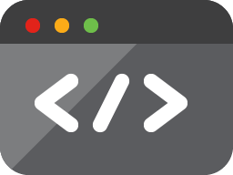

  

<h1 align="center">Hi , I'm Raj Mhatre</h1>
<h3 align="center">Developer | Student</h3>
 

&nbsp;
&nbsp; 
&nbsp; 
&nbsp; 

  

  <em>
    This is ME, Raj Mhatre, a <b>third year</b> undergraduate from <a href="http://cms.sinhgad.edu/sinhgad_engineering_institutes/nbn-ssoe,-ambegaon-(bk)/faqs.aspx"> <b>N.B.N sinhgad school of engineering</b>, Pune</a>.  
    A budding <b>Full-Stack Software Developer</b>  and a <b>Competitive Programming Enthusiast</b>&nbsp;&nbsp, who is <b>obsessed</b>
    with the idea of <b>improving</b> himself and wants a <b>platform</b> to 
    <b>grow</b> and 
    <b>excel</b> &nbsp.
  </em> 
   
   <b><i>Learning while HOPING & HUSTLING!!!</i></b> 

  

&nbsp;&nbsp;**_Languages and Tools_**
 
 
&nbsp;&nbsp;
&nbsp;&nbsp;
&nbsp;&nbsp;
&nbsp;&nbsp;
&nbsp;&nbsp;
&nbsp;&nbsp;
&nbsp;
&nbsp;
&nbsp;&nbsp;
&nbsp;&nbsp;
 

&nbsp;**_Talking about Personal Stuffs..._**

✔ Pronouns: **_He/His_**  
✔ I’m currently learning **MonjoDB** & **NodeJS** 
✔ I’m looking to collaborate with any **Open - Source contribution** 
✔ I’m looking for help for learning **Backend Development** 
✔ Ask me about anything, I am happy to help, only if the ball is in my court!😉 
✔ Fun fact : _At The time of Stress coding, I use to be in half sleeping mode_    

&nbsp; **_GitHub Analytics_**

  

&nbsp; **_Here's a joke for you:_** 

